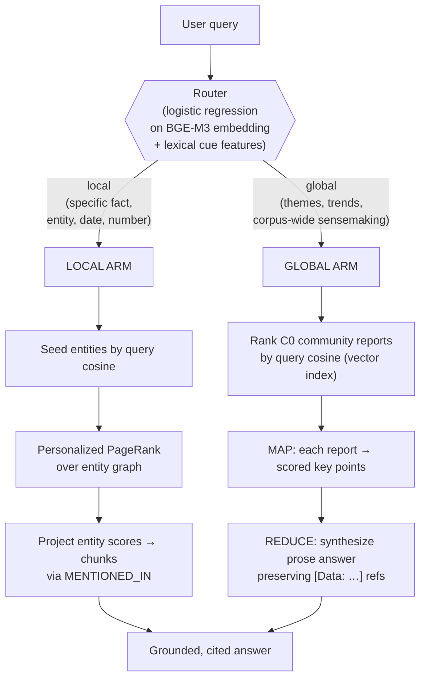
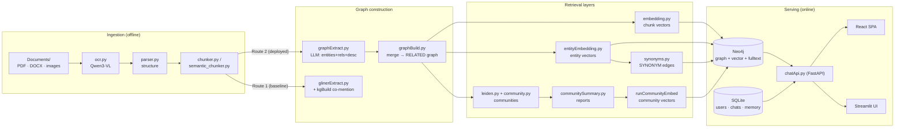
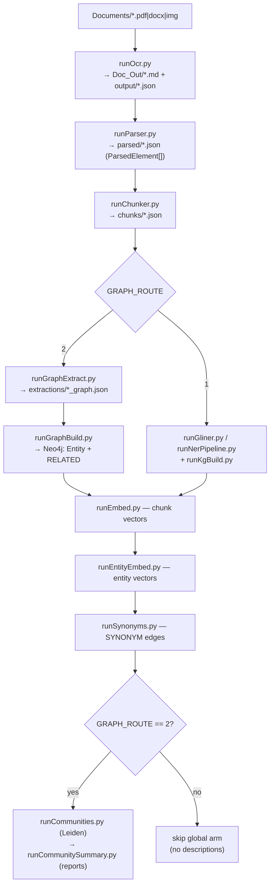
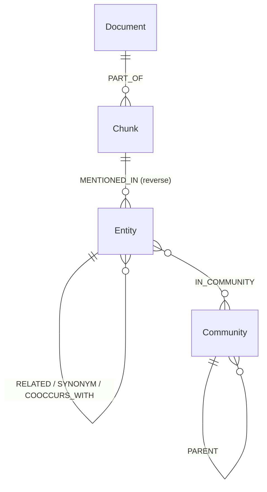
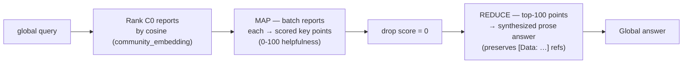
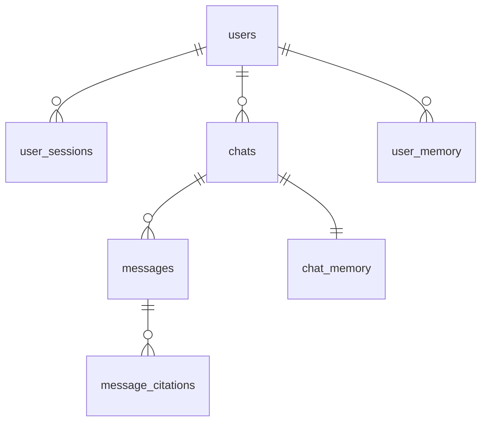

<div align="center">


# Gazelle

**A graph-grounded, hallucination-resistant RAG system for Arabic banking & finance compliance documents.**

Ingest scanned regulatory PDFs → build a knowledge graph + vector index → answer compliance questions with verbatim, chunk-level citations through a dual-arm (local **PPR** + global **GraphRAG**) retrieval engine.


</div>

> [!IMPORTANT]
> **This README documents the `dev` branch**, which is the most complete, current architecture (SQLite airgapped build, logistic-regression router, full global/community-summary arm, PPR local retrieval, and a pytest suite). The default `main` branch is an **earlier** state (PostgreSQL, LLM-only router, no community summarization).
>
> The prose design docs under `docs/` (`GLOBAL_PLAN.md`, `PROCESS.md`, the original `CLAUDE.md`/`AGENTS.md`) describe an **earlier plan** and are **partially stale** — where they disagree with the code, **the code wins**. This document was written by reading the source directly.

---

## Table of Contents

1. [What is Gazelle?](#1-what-is-gazelle)
2. [Key Features](#2-key-features)
3. [The Two Arms: Local + Global](#3-the-two-arms-local--global)
4. [System Architecture](#4-system-architecture)
5. [Tech Stack](#5-tech-stack)
6. [Repository Layout](#6-repository-layout)
7. [Prerequisites & Required Services](#7-prerequisites--required-services)
8. [Installation](#8-installation)
9. [Configuration (`.env`)](#9-configuration-env)
10. [Quick Start](#10-quick-start)
11. [The Ingestion Pipeline](#11-the-ingestion-pipeline)
12. [Graph Construction: Two Routes](#12-graph-construction-two-routes)
13. [Knowledge Graph Schema (Neo4j)](#13-knowledge-graph-schema-neo4j)
14. [Ontology](#14-ontology)
15. [Retrieval Engine](#15-retrieval-engine)
16. [The Query Router (Logistic Regression)](#16-the-query-router-logistic-regression)
17. [The Global Arm (GraphRAG Community Summaries)](#17-the-global-arm-graphrag-community-summaries)
18. [Chat API Reference](#18-chat-api-reference)
19. [Data Model (SQLite)](#19-data-model-sqlite)
20. [Conversational Memory](#20-conversational-memory)
21. [Authentication, Roles & Access Control](#21-authentication-roles--access-control)
22. [Admin Document Publishing](#22-admin-document-publishing)
23. [Classical NER Subsystem (CRF)](#23-classical-ner-subsystem-crf)
24. [Frontend (React SPA)](#24-frontend-react-spa)
25. [Streamlit UI](#25-streamlit-ui)
26. [Evaluation](#26-evaluation)
27. [Testing](#27-testing)
28. [Runners Reference](#28-runners-reference)
29. [Airgapped Deployment](#29-airgapped-deployment)
30. [Coding Conventions](#30-coding-conventions)
31. [Documentation Index](#31-documentation-index)
32. [Project Status & Roadmap](#32-project-status--roadmap)
33. [Troubleshooting](#33-troubleshooting)
34. [License](#34-license)

---

## 1. What is Gazelle?

Gazelle is a **retrieval-augmented generation (RAG) system built for regulatory compliance**, where a wrong or unsupported answer is a liability. Its target domain is **Central Bank of Egypt (CBE)** banking regulation (deployed for **Abu Dhabi Islamic Bank — ADIB**), and most source material is **scanned Arabic legal text**.

Two hard constraints shape every design decision:

- **Provenance end-to-end.** Every stage preserves the lineage *source document → page → chunk → entity → answer*. The chatbot can always point to the exact chunk a claim came from.
- **Hallucination resistance.** Answers are strictly grounded in retrieved, cited evidence. A dedicated system prompt forces a `[chunkId]` citation on every claim and requires an **exact refusal sentence** when the context is insufficient — no general-knowledge fallback, temperature pinned to `0`.

Gazelle is also a **research platform**: it implements and benchmarks a **HippoRAG-style Personalized PageRank** local retriever *and* a **Microsoft-GraphRAG-style global community-summary** arm, with a learned router deciding which arm answers each query.

---

## 2. Key Features

- 📄 **Arabic OCR pipeline** — Qwen3-VL vision model via Ollama, tuned to preserve Arabic-Indic numerals, tables, and RTL signature/hierarchy structure. Optional ML **handwriting removal** preprocessing (RandomForest / XGBoost).
- 🧩 **Structure-aware chunking** — section-path-aware, token-budgeted (BGE-M3 tokenizer), atomic tables, semantic-split option.
- 🕸️ **Knowledge-graph construction, two routes** — a cheap deterministic **GLiNER + co-mention** baseline, and a deployed **full-LLM** route that extracts entities **+ relationships + descriptions** in one pass.
- 🔀 **Dual-arm retrieval with a learned router** — a **logistic-regression** classifier routes each query to the **local** arm (Personalized PageRank over the entity graph → chunks) or the **global** arm (map-reduce over hierarchical community summaries).
- 🌐 **GraphRAG global sensemaking** — Leiden community detection → LLM-written analyst reports with `[Data: Entities…; Relationships…]` provenance → query-focused map-reduce answers.
- 💬 **Streaming chat API** — FastAPI + Server-Sent Events, citations streamed first, grounded answer token-by-token.
- 🔐 **Role-based access control at the retrieval layer** — clearance-filtered in Cypher; chunks a user cannot see never reach the LLM.
- 🧠 **Two-layer conversational memory** — incremental chat summaries + promoted long-term user preferences, with PII gating.
- 🖥️ **Two UIs** — a polished **React + Cytoscape** SPA (chat, citations, graph explorer, admin console) and a **Streamlit** dashboard.
- 🧪 **Benchmarked** — MuSiQue recall@K for the local arm; BenchmarkQED LLM-judge win-rates (AP News) for the global arm; a pytest unit/module/integration suite.
- 🔌 **Airgapped-ready** — SQLite-only persistence, local models, Neo4j dump/restore for USB transport.

---

## 3. The Two Arms: Local + Global

Gazelle answers two fundamentally different kinds of question, and a learned router picks the arm per query:



| | **Local arm** | **Global arm** |
|---|---|---|
| **Answers** | "What is the minimum capital adequacy ratio?" | "What are the main themes across these regulations?" |
| **Method** | Personalized PageRank (HippoRAG-style) over the entity graph, projected to chunks | GraphRAG map-reduce over hierarchical Leiden **community summaries** |
| **Module** | `src/localRetrieve.py` | `src/globalSearch.py` + `src/communitySummary.py` |
| **Benchmark** | MuSiQue recall@K (`musique/`) | BenchmarkQED win-rate on AP News (`sensemaking/`) |
| **Requires** | Any graph route | **Route 2** (needs entity/relationship descriptions) |

---

## 4. System Architecture



### Services

| Service | Purpose | Default |
|---|---|---|
| **Ollama** | OCR (`qwen3-vl:8b-instruct-q4_K_M`), embeddings (`bge-m3`), local chat/extract (`llama3.1:8b`) | `localhost:11434` |
| **Neo4j** | Knowledge graph + vector indexes (chunk/entity/community) + fulltext | `bolt://localhost:7687` |
| **SQLite** | Users, sessions, chats, messages, citations, memory, audit | `./gazelle.db` |
| **OpenRouter** *(optional)* | Cloud LLM for Route-2 extraction & community summaries | API key |
| **Groq / Gemini** *(optional)* | Alternative cloud LLM backends | API key |

---

## 5. Tech Stack

| Layer | Technology |
|---|---|
| **OCR / Vision** | Qwen3-VL via Ollama (or `llama-server`), `pypdfium2` rasterization |
| **Document parsing** | `docling` (DOCX), `pypdf` (digital PDF text layer) |
| **Chunking / Tokenizer** | BGE-M3 tokenizer, custom section-aware + semantic chunkers |
| **NER** | GLiNER (`NAMAA-Space/gliner_arabic-v2.1`), LLM NER, classical CRF (`sklearn-crfsuite`, `camel-tools`) |
| **Relation / graph extraction** | LLM OpenIE (Ollama / Groq / OpenRouter / Gemini) |
| **Embeddings** | BGE-M3 dense, 1024-dim (`FlagEmbedding` or Ollama `bge-m3`) |
| **Graph DB** | Neo4j 5.x (vector + fulltext indexes) |
| **Graph algorithms** | Personalized PageRank, Leiden (both from-scratch, `scipy` sparse), `networkx` |
| **Router** | `scikit-learn` `LogisticRegression` (calibrated), lexical cue features |
| **API** | FastAPI + `uvicorn`, SSE streaming, `httpx` |
| **Persistence** | SQLite via async SQLAlchemy 2.0 + `aiosqlite`, `bcrypt` auth |
| **Frontend** | Vite + React 18 + Tailwind, Cytoscape.js (`fcose` layout) |
| **Dashboard** | Streamlit |
| **Testing** | `pytest`, `pytest-cov`, `pytest-mock` |
| **Eval** | MuSiQue harness; Microsoft BenchmarkQED (`benchmark-qed`) for sensemaking |

---

## 6. Repository Layout

```
Gazelle/
├── src/                       Importable modules (on sys.path via runners/_bootstrap.py)
│   ├── ocr.py                 Stage 1 — Qwen3-VL OCR (Arabic)
│   ├── ocrPreprocessing.py    Handwriting-removal model (RF/XGB) before OCR
│   ├── parser.py              Stage 2 — OCR-md / DOCX → ParsedElement[]
│   ├── chunker.py             Stage 3 — section-aware token-budgeted chunking
│   ├── semantic_chunker.py    Stage 3 — semantic-split alternative
│   ├── embedding.py           BGE-M3 chunk/query embeddings + Neo4j indexes
│   ├── ontology.py            Entity/relationship schema (AR + EN), single source of truth
│   │
│   ├── glinerExtract.py       Route 1 — GLiNER Arabic NER
│   ├── llmNER.py              LLM-based NER (alternative)
│   ├── kgBuild.py             Route 1 — entity layer + COOCCURS_WITH co-mention edges
│   ├── graphExtract.py        Route 2 — LLM entities+relationships+descriptions
│   ├── graphBuild.py          Route 2 — merge instances → RELATED graph in Neo4j
│   ├── typedOntologyExtract.py / typedKgWriter.py   Typed-ontology extraction variant
│   ├── entityEmbedding.py     Entity embeddings (seeding + synonyms)
│   ├── entityAlign.py         Cosine-sim entity deduplication
│   │
│   ├── localRetrieve.py       LOCAL ARM — PPR over entity graph → chunks
│   ├── retriever.py           Retrieval dispatcher (auto/vector/hybrid/fusion/graph)
│   ├── router.py              Query router (logistic regression; LLM fallback)
│   ├── routerFeatures.py      Bilingual lexical cue features for the router
│   ├── community.py           Persist Leiden hierarchy → (:Community) skeleton
│   ├── communitySummary.py    GLOBAL ARM — LLM community reports with provenance
│   ├── globalSearch.py        GLOBAL ARM — map-reduce answer over community reports
│   │
│   ├── chatApi.py             FastAPI app (chat, retrieve, graph, admin, memory, auth)
│   ├── auth.py                Bearer-token auth, role gating (requireAdmin)
│   ├── docAccess.py           Clearance levels + per-document access map
│   ├── ingest.py              Incremental admin ingestion orchestrator
│   ├── memory/                assembler.py · summarizer.py · promoter.py
│   ├── db/                    SQLAlchemy Base, models, session, repositories/
│   ├── llmTriples.py          Multi-backend callLLM() (ollama|groq|openrouter|gemini)
│   ├── openRouter.py          OpenRouter client
│   ├── scrapeCbe.py / scrapeFra.py / icijLoad.py   Data-acquisition utilities
│   └── classical_NER/         CRF NER subsystem (see §23)
│
├── runners/                   One thin entry-point script per stage (import _bootstrap)
│   └── runPipeline.py         Consolidated from-scratch orchestrator
├── graphTraversal/            PPR / Leiden research subsystem + validation
├── router/                    Router training data, train.py, evalHoldout.py
├── musique/                   Local-arm retrieval benchmark (recall@K)
├── sensemaking/               Global-arm BenchmarkQED eval (AP News)
├── tests/                     pytest: unit-tests/ · module-tests/ · integration-tests/
├── eval/                      Retrieval eval harness + gold queries
├── frontend/                  React + Vite + Tailwind + Cytoscape SPA
├── ui.py                      Streamlit UI (single file)
├── alembic/                   Legacy Postgres migrations (unused on the SQLite build)
├── docs/                      Design docs (partially stale — see note at top)
├── config / requirements.txt / Makefile / Modelfile / .env-example
└── Documents/ Doc_Out/ parsed/ chunks/ extractions/   Pipeline data (gitignored)
```

---

## 7. Prerequisites & Required Services

- **Python 3.11+** (Conda recommended — see `.vscode/settings.json`)
- **Node.js 18+** (for the React frontend)
- **Neo4j 5.x** running and reachable
- **Ollama** running, with the required models pulled
- *(optional)* **OpenRouter / Groq / Gemini** API keys for cloud LLM backends

### Ollama models

```bash
ollama pull qwen3-vl:8b-instruct-q4_K_M   # OCR (vision)
ollama pull bge-m3                         # embeddings
ollama pull llama3.1:8b                    # local chat / extraction
```

Or let the helper pull everything referenced in your `.env`:

```bash
python runners/pullModels.py
```

> **Note:** `GLINER_MODEL` in `src/config.py` is currently a **hard-coded absolute Windows path** to a Hugging Face cache snapshot. Change it to `NAMAA-Space/gliner_arabic-v2.1` (or your local snapshot path) for any other machine.

---

## 8. Installation

```bash
# 1. Clone
git clone https://github.com/OmarrKaddah/Gazelle.git
cd Gazelle
git checkout dev          # the branch this README documents

# 2. Python deps
pip install -r requirements.txt        # or: make install

# 3. Frontend deps
cd frontend && npm install && cd ..    # or: make install-frontend

# 4. Environment
cp .env-example .env                   # then edit — see §9

# 5. Database (SQLite) — created & seeded automatically on first API start
#    (Base.metadata.create_all + seed users; no migration step needed)
```

---

## 9. Configuration (`.env`)

All tunables live in `src/config.py`, most overridable by environment variable. The single most important knob:

```bash
GRAPH_ROUTE=2      # 1 = GLiNER + co-mention (classical baseline, local-only)
                   # 2 = full-LLM entities + RELATED{predicate,description}
                   #     (DEPLOYED default; required for the global/community arm)
```

### Core

| Variable | Default | Meaning |
|---|---|---|
| `GRAPH_ROUTE` | `2` | Master graph-construction route (see [§12](#12-graph-construction-two-routes)) |
| `CORPUS_NAME` | `cbe` | Corpus tag on `(:Community {corpus})`; scope key for the global arm |
| `CHAT_DOMAIN` | `compliance` | System-prompt framing: `compliance` (CBE/ADIB) or `general` (open-domain) |
| `NER_STRATEGY` | `gliner` | `gliner` · `llm` · `classical` (CRF) — Route 1 entity extraction |
| `CHUNKER_TYPE` | `semantic` | `default` or `semantic` |
| `DATABASE_URL` | `sqlite+aiosqlite:///./gazelle.db` | **SQLite only** — non-sqlite URLs are ignored |

### Neo4j

| Variable | Default |
|---|---|
| `NEO4J_URI` | `bolt://localhost:7687` |
| `NEO4J_USER` / `NEO4J_PASSWORD` | *(required)* |
| `NEO4J_DB` | `neo4j` |

### Models & LLM backends

| Variable | Default | Used by |
|---|---|---|
| `OLLAMA_URL` | `http://localhost:11434/v1/chat/completions` | chat/extract |
| `OLLAMA_VISION_MODEL` | `qwen3-vl:8b-instruct-q4_K_M` | OCR |
| `OLLAMA_CHAT_MODEL` | `llama3.1:8b` | chat |
| `OLLAMA_EXTRACT_MODEL` | `llama3.1:8b` | relation extraction |
| `OLLAMA_EMBED_MODEL` / `OLLAMA_EMBED_URL` | `bge-m3` | embeddings |
| `BGE_M3_PATH` | `BAAI/bge-m3` | local embedding model |
| `GRAPH_EXTRACT_BACKEND` | `openrouter` | Route-2 extraction backend (`ollama\|groq\|openrouter\|gemini`) |
| `GRAPH_EXTRACT_WORKERS` | `12` | Route-2 parallel chunk requests |
| `OPENROUTER_API_KEY` / `OPENROUTER_MODEL` | — / `meta-llama/llama-3.3-70b-instruct` | OpenRouter |
| `GROQ_API_KEY` / `GROQ_MODEL` | — / `llama-3.3-70b-versatile` | Groq |
| `GEMINI_API_KEY` / `GEMINI_MODEL` | — / `gemini-2.0-flash` | Gemini |

### Retrieval, graph & extraction constants (`src/config.py`)

| Constant | Default | Meaning |
|---|---|---|
| `EMBED_DIM` | `1024` | BGE-M3 dimension |
| `GLINER_THRESHOLD` | `0.7` | GLiNER confidence cutoff |
| `SYNONYM_THRESHOLD` | `0.85` | Cosine cutoff for `SYNONYM` identity edges |
| `COMMUNITY_RESOLUTION` | `1.0` | Leiden resolution |
| `SIM_THRESHOLD` | `0.92` | Entity-alignment dedup cutoff |
| `RRF_K` | `60` | Reciprocal-rank-fusion constant |
| `SEED_K` / `PATH_DEPTH` / `PATH_LIMIT` | `8` / `3` / `300` | Graph-mode traversal |
| `ENTITY_WEIGHT` | `0.6` | Path score = 0.6·entity_sim + 0.4·rel_sim |
| `LOCAL_COMENTION_EDGES` | `0` | Walk `COOCCURS_WITH` in local PPR (Route 1 graphs) |

### Handwriting-removal preprocessing (optional)

`HANDWRITING_PREPROCESSING=1` enables an ML pass that strips handwriting before OCR — tunable via `HANDWRITING_MODEL_PATH`, `HANDWRITING_PATCH_SIZE`, `HANDWRITING_PATCH_STRIDE`, `HANDWRITING_PATCHES_PER_IMAGE`, `HANDWRITING_THRESHOLD`.

---

## 10. Quick Start

```bash
# Terminal A — API (creates + seeds gazelle.db on first run)
python runners/runApi.py            # → http://127.0.0.1:8000   (or: make run-api)

# Terminal B — frontend dev server (proxies /api → :8000)
cd frontend && npm run dev          # → http://localhost:5173   (or: make run-frontend)
```

Open **http://localhost:5173**, log in with a seed user (see [§21](#21-authentication-roles--access-control)), and start chatting.

**To ingest documents from scratch**, drop files in `Documents/` and run the consolidated pipeline:

```bash
python runners/runPipeline.py       # OCR → parse → chunk → graph → embed → communities → summaries
```

---

## 11. The Ingestion Pipeline

`runners/runPipeline.py` orchestrates the full offline pipeline. Each stage is a standalone runner with **skip-if-exists** logic, so re-runs are cheap and the orchestrator and individual runners can't drift.



**Stage detail:**

| Stage | Module | Output |
|---|---|---|
| **1. OCR** | `ocr.py` | `Doc_Out/{doc}.md` + `output/{doc}.json` per-page sidecar. Qwen3-VL, parallel pages, Arabic-tuned prompt, preserves Arabic-Indic numerals & tables. |
| **2. Parse** | `parser.py` | `parsed/{doc}.json` — unified `ParsedElement[]` (`heading\|paragraph\|table\|list`) with a heading stack producing `sectionPath`, `page`, `accessLevel` provenance. DOCX via `docling`. |
| **3. Chunk** | `chunker.py` / `semantic_chunker.py` | `chunks/{doc}.json` — section-aware, token-budgeted (`CHUNK_TARGET_TOKENS=600`), atomic tables, section heading prepended for embedding context, overlap across splits. |
| **4. Graph** | Route 1 or Route 2 | Neo4j `Chunk` + `Entity` (+ `RELATED` on Route 2). See [§12](#12-graph-construction-two-routes). |
| **5. Embed chunks** | `embedding.py` | `Chunk.embedding` (1024-dim) + `chunk_embedding` vector index + `chunk_text` fulltext index. |
| **6. Embed entities** | `entityEmbedding.py` | `Entity.embedding` + `entity_embedding` vector index (seeds the PPR local arm). |
| **7. Synonyms** | `graphTraversal/synonyms.py` | `SYNONYM` edges bridging duplicate entities (cosine ≥ `SYNONYM_THRESHOLD`, same type, token-subset filter). |
| **8. Communities** | `graphTraversal/leiden.py` + `community.py` | `(:Community)` hierarchy skeleton (Route 2 only). |
| **9. Summaries** | `communitySummary.py` | LLM analyst reports written onto `(:Community)` nodes (Route 2 only). |

---

## 12. Graph Construction: Two Routes

The `GRAPH_ROUTE` knob selects the entire downstream shape of the graph:

### Route 1 — Classical (baseline)
`glinerExtract.py` → `kgBuild.buildEntityLayer`. GLiNER Arabic NER extracts typed entities; edges are **co-mention** `COOCCURS_WITH {count}` between entities in the same chunk. **Deterministic, cheap, local-retrieval only** — no descriptions, so it cannot feed the global arm. `NER_STRATEGY=classical` swaps GLiNER for the CRF pipeline ([§23](#23-classical-ner-subsystem-crf)).

### Route 2 — Full-LLM (deployed)
`graphExtract.py` → `graphBuild.py`. **One LLM pass per chunk** extracts entities **and** relationships **and** descriptions:

```json
{
  "entities":      [{"name": "...", "type": "...", "description": "..."}],
  "relationships": [{"source": "...", "target": "...", "predicate": "...", "description": "..."}]
}
```

`graphBuild.py` then merges per-chunk instances into unique entities (descriptions aggregated, aliases + chunkIds tracked) and unique `RELATED` edges (**weight = number of times the relationship was extracted**, predicate = plurality vote, descriptions aggregated), dropping orphan-endpoint and self-referential edges. Route 2 is **resume-safe** (partial results in `extractions/{doc}_graph.json`), parallel, and JSON-salvages malformed LLM output. It is the **only route that feeds the global/community arm**, because community summaries consume the descriptions.

---

## 13. Knowledge Graph Schema (Neo4j)



**Passage layer**
- `(:Document {docName})`
- `(:Chunk {chunkId, docName, sectionPath, pages, text, accessLevel, embedding})` `-[:PART_OF]->(:Document)`

**Concept layer** (walked by PPR / Leiden)
- `(:Entity {canonicalId, canonicalName, type, description, aliases, docName, embedding})`
- `(:Entity)-[:MENTIONED_IN]->(:Chunk)` — projection only (entity → passage)
- `(:Entity)-[:RELATED {weight, predicate, description}]->(:Entity)` — **Route 2**
- `(:Entity)-[:COOCCURS_WITH {count}]->(:Entity)` — **Route 1**
- `(:Entity)-[:SYNONYM {cosine}]->(:Entity)` — identity bridges

**Community layer** (global arm)
- `(:Community {id, level, corpus, title, summary, rating, findings, report, embedding})` — `level 0 = root`
- `(:Entity)-[:IN_COMMUNITY {level}]->(:Community)`
- `(:Community)-[:PARENT]->(:Community)` — child (finer) → parent (coarser), assigned by plurality vote

**Indexes:** vector indexes `chunk_embedding`, `entity_embedding`, `community_embedding`; fulltext index `chunk_text`. Unique constraints on `Document.docName`, `Chunk.chunkId`, `Entity.canonicalId`.

> **Design note:** PPR walks **only** entity-entity edges; chunks are reached separately via `MENTIONED_IN` projection. One physical graph serves both the concept and passage layers — the separation is enforced *in the query*, not the topology.

---

## 14. Ontology

`src/ontology.py` is the **single source of truth** — GLiNER labels, LLM extraction prompts, KG validation, and retriever relation-type scoring all import from it. `ontologyFor(docName)` picks the Arabic banking ontology or the English general-knowledge ontology by language.

**Arabic banking entities (11):** `Person`, `BankingInstitution`, `RegulatoryBody`, `Law`, `Article`, `License`, `Document`, `FinancialInstrument`, `RegulatoryRequirement`, `MonetaryAmount`, `Date`.

**English general entities (10):** `Person`, `Organization`, `Location`, `Work`, `Event`, `Date`, `Nationality`, `Occupation`, `Award`, `Language` (used for MuSiQue / AP News corpora).

**Relationship types (typed routes):** `ISSUED_BY`, `GOVERNS`, `AMENDS`, `SUPERSEDES`, `PART_OF`, `REQUIRES`, `SIGNED_BY`, `EFFECTIVE_FROM`, `APPLIES_TO` — each with allowed subject/object type tuples and bilingual natural-language descriptions used to embed relations for query-relation semantic scoring in graph mode.

> Route 2 uses free-form 1–3-word predicates rather than the fixed typed vocabulary; the typed relationship set governs the graph-mode scorer and the typed extraction variant (`typedOntologyExtract.py`).

---

## 15. Retrieval Engine

`retrieve(query, mode='vector', k=5, clearance='public', corpus='', useLlmMap=True)` in `src/retriever.py` dispatches by mode. **Every mode pre-filters chunks by the user's clearance** (`docAccess.allowedDocs(clearance)`) before scoring — access control happens in Cypher, not the UI.

| Mode | Behavior |
|---|---|
| **`auto`** | Runs the **router** ([§16](#16-the-query-router-logistic-regression)). `global` → `globalSearch` (community map-reduce); `local` → runs the local arm, labeled `local` so the frontend renders the entity graph. |
| **`vector`** | Pure semantic: embed query → Neo4j `chunk_embedding` vector index (4× overfetch, then clearance-filter → top-k). |
| **`hybrid`** / **`fusion`** | Reciprocal-rank fusion of vector + Neo4j fulltext (BM25): `score = Σ 1/(RRF_K + rank)`. |
| **`graph`** | **Local PPR arm** via `localRetrieve.getLocalIndex()`. |

### Local arm — Personalized PageRank (`src/localRetrieve.py`)

`LocalIndex` loads all heavy state **once** (entity embeddings, a symmetrised CSR adjacency over `RELATED` + `SYNONYM` [+ optional `COOCCURS_WITH`] edges, and the `MENTIONED_IN` entity→chunk map) so per-query cost is small. Per query:

1. **Seed** — embed query (BGE-M3), cosine-rank all *clearance-allowed* entities, take top-5, normalise to a seed-mass vector.
2. **Walk** — Personalized PageRank (`r ← (1-α)·Mᵀr + α·s`, `α = 0.15`, power iteration to L1 tolerance).
3. **Project** — spread entity scores onto chunks via `MENTIONED_IN`, sum per chunk, return top-k with **contributor entities** and **path edges** (for the graph visualization).

This is the productionised HippoRAG-style retriever; its research lineage and full versioned benchmark log live in [`graphTraversal/`](graphTraversal/Graph_TRAVERSAL.md) and [`docs/PROCESS.md`](docs/PROCESS.md).

---

## 16. The Query Router (Logistic Regression)

`src/router.py` decides **global vs local** for `mode='auto'`.

- **Model:** a calibrated `scikit-learn` `LogisticRegression` (via `CalibratedClassifierCV`) over **BGE-M3 query embeddings + 14 bilingual lexical cue features** (`src/routerFeatures.py`), persisted as `src/models/router.joblib` (`{model, threshold, globalIdx}`).
- **Decision:** `routeQuery(query)` embeds the query and returns `'global'` if `predict_proba ≥ threshold` else `'local'`. An **asymmetric threshold** is tuned in training toward `GLOBAL_PRECISION_TARGET = 0.85` — global answers are expensive, so the router is precision-first on the `global` class.
- **Fallback:** if no trained artifact exists yet, `routeQuery` falls back to a one-shot **LLM classifier** (the original design), so the system works before the model is trained.

**Cue features** (`routerFeatures.cueFeatures`) count Arabic + English signals: global cues (`اتجاهات`, `عبر الوثائق`, `themes`, `overall`, `across`), local cues (`ما هو`, `كم`, `what is`, `define`), comparison/aggregate cues, wh-question types, digit presence, and token count — with Arabic normalization (strip harakat, unify alef/ya/ta-marbuta).

**Training & evaluation** live in `router/`:
- `router/genData.py` / `genEval.py` — synthesise + label training/holdout queries.
- `router/train.py` — embed (cached), fit calibrated LR, tune the asymmetric threshold, write `src/models/router.joblib`.
- `router/evalHoldout.py` — report precision/recall/F1 on real + LLM-generated holdout sets.
- `runners/runRouter.py` — quick CLI to see routing decisions.

---

## 17. The Global Arm (GraphRAG Community Summaries)

The global arm answers **corpus-wide sensemaking** questions ("main themes / trends / risks across the documents") by summarizing the whole corpus, following Microsoft GraphRAG (*From Local to Global*, Edge et al. 2024).

### Build (offline, Route 2 only)

1. **Communities** — `graphTraversal/leiden.py` runs from-scratch Leiden on the entity graph; `src/community.py` persists the full hierarchy as `(:Community)` nodes with `IN_COMMUNITY` and `PARENT` links.
2. **Summaries** — `src/communitySummary.py` walks the hierarchy **finest → root**. For each community it gathers members + `RELATED` edges (ranked by degree / weight), formats them as numbered `E#` / `R#` records, and prompts an LLM to write a structured report:

   ```json
   {"title": "...", "summary": "...", "rating": 0-10, "rating_explanation": "...",
    "findings": [{"summary": "...", "explanation": "... [Data: Entities (E0); Relationships (R2)]"}]}
   ```

   Every finding **must cite its supporting records** inline — that is the global arm's hallucination-resistance guarantee. Leaf communities are summarized from elements; parents **roll up** child reports (substituting child summaries when over an 8 000-char budget). Reports are written onto the `(:Community)` nodes and are resume-safe.
3. **Community embeddings** — `runners/runCommunityEmbed.py` embeds each report into the `community_embedding` vector index.

### Answer (online) — `src/globalSearch.py`



If no community reports exist for the corpus, it returns the exact **refusal sentence** rather than guessing.

### Sensemaking evaluation

`sensemaking/` benchmarks this arm end-to-end with **Microsoft BenchmarkQED** on the open **AP News** corpus: AutoQ synthesises global questions, AutoE runs pairwise LLM-judge win-rates (comprehensiveness / diversity / empowerment / relevance) of the global arm vs a naive vector-RAG baseline. See [`sensemaking/README.md`](sensemaking/README.md).

---

## 18. Chat API Reference

FastAPI app in `src/chatApi.py`, served by `runners/runApi.py` on `:8000`. Auth is `Authorization: Bearer <token>`; the local `LocalIndex` is warmed on startup.

| Method & path | Purpose |
|---|---|
| `POST /api/login` | Username/password → bearer token |
| `POST /api/logout` | Invalidate token |
| `GET /api/me` | Current user |
| `GET /api/info` | Providers + availability, clearance levels, corpus name |
| `POST /api/retrieve` | Run retriever, return chunks (clearance-gated) |
| `POST /api/chat` | Retrieve **then stream** the grounded answer (SSE) |
| `GET /api/graph` | Cytoscape-shaped entity/edge JSON (`?search= &type= &seed= &hops=`) |
| `POST /api/admin/documents/publish` | **Admin-only** multipart upload + incremental ingest (SSE log stream) |
| `GET/POST /api/chats` · `GET/PATCH/DELETE /api/chats/{id}` | Chat CRUD |
| `GET/PUT /api/chats/{id}/memory` | Per-chat memory |
| `GET /api/memory/user` · `PUT /api/memory/user/{key}` | Long-term user memory |

**`POST /api/chat` request:**

```json
{ "query": "...", "chatId": "uuid|null", "mode": "auto", "k": 5, "provider": "ollama" }
```

**SSE event stream:**

```
data: {"type":"citations","citations":[{"chunkId":"...","docName":"...","score":0.87}]}
data: {"type":"token","text":"..."}
...
data: {"type":"done"}
```

The user message, assistant message, and per-message citations are persisted; the chat summariser and user-memory promoter run as background tasks. **Grounding is enforced by the system prompt** (`CHAT_DOMAIN` selects the `compliance` or `general` variant): cite every claim by `[chunkId]`, refuse with the exact bilingual sentence when context is insufficient, temperature `0`.

---

## 19. Data Model (SQLite)

Async SQLAlchemy 2.0 (`aiosqlite`). Schema is created via `Base.metadata.create_all` on first start (`src/db/session.py`), and seed users are inserted if the table is empty — **no Alembic step on this build**.



| Table | Key columns |
|---|---|
| `users` | `username`, `role`, `clearance`, `passwordHash` (bcrypt) |
| `user_sessions` | `tokenHash` (SHA-256) — bearer sessions survive restarts |
| `chats` / `messages` | per-user conversations; `messages.tokenCount`, `role`, `content` |
| `message_citations` | `chunkId`, `docName`, `score`, `rank` — provenance per assistant turn |
| `chat_memory` | rolling `summary`, `summaryTokens`, `lastSummarizedMessageId` watermark |
| `user_memory` | `category` (preference/instruction/profile/domain), `source` (explicit/promoted/inferred), `confidence`, `evidenceChatId` |
| `audit_logs` | `action`, `entityType`, `entityId` (e.g. admin document publishing) |

Repositories under `src/db/repositories/` (`authRepo`, `chatRepo`, `memoryRepo`, `citationRepo`, `auditRepo`) keep SQL out of the API layer.

---

## 20. Conversational Memory

`src/memory/` gives follow-up questions and durable preferences a home, with provenance and PII gating:

- **`assembler.py`** — packs the LLM prompt with strict per-layer token budgets in a canonical order (system → user memory → chat summary → recent turns → context → question).
- **`summarizer.py`** — an **incremental, debounced** rolling chat summary (only re-runs when enough new turns/tokens accumulate; uses the `lastSummarizedMessageId` watermark so it's linear, not quadratic), with PII redaction in the prompt.
- **`promoter.py`** — lifts stable user statements ("always answer in Arabic") into `user_memory` from a small regex allowlist, gated by a PII filter that refuses any text with 10+ digit runs.

The chat endpoint loads user memory + chat summary + recent messages, assembles them, writes citations synchronously, and schedules the summariser and promoter as background tasks. Deep rationale: [`docs/MEMORY_ARCHITECTURE.md`](docs/MEMORY_ARCHITECTURE.md) and [`docs/DESIGN_RATIONALE.md`](docs/DESIGN_RATIONALE.md).

---

## 21. Authentication, Roles & Access Control

Bearer-token auth (`src/auth.py`) backed by SQLite; token hashes stored in `user_sessions`. `getCurrentUser` is a FastAPI dependency on every protected route; `requireAdmin` gates the admin endpoints **server-side** (not just the UI).

**Document access control** (`src/docAccess.py`): clearance levels are rank-ordered `public < internal < confidential < restricted`. `allowedDocs(clearance)` returns the docs visible at a level, and **every retrieval query filters `WHERE node.docName IN $allowed`** — a user never receives chunks above their clearance.

**Seed users** (created on first start; demo credentials — change for any real deployment):

| Username | Role | Clearance |
|---|---|---|
| `omar` | Admin | restricted |
| `sara` | Senior Compliance | confidential |
| `ahmed` | Compliance Analyst | internal |
| `guest` | External | public |

---

## 22. Admin Document Publishing

Admins can upload documents into the **live** graph **incrementally** — new docs/entities/relationships are added without rebuilding.

- **Frontend:** `Admin` role users land on an **Admin Console** (`frontend/src/components/AdminPage.jsx`) — drag-and-drop upload, per-file status, and a **Publish** button. Role logic is centralized in `frontend/src/lib/roles.js` and enforced by `RequireRole.jsx`.
- **Backend:** `POST /api/admin/documents/publish` (guarded by `requireAdmin`) saves files, runs `src/ingest.py` off the event loop, **streams a live log** over SSE, and writes an audit entry. Ingestion uses MERGE-based writers (**no `clearDb`**), so existing graph data is preserved; the entity-embed and dedup passes run once at the end so new entities link in.
- Digital PDFs are read via their text layer, DOCX via paragraph/table extraction; only images and scanned PDFs fall back to the OCR vision model.

---

## 23. Classical NER Subsystem (CRF)

`src/classical_NER/` is a self-contained, domain-adapted Arabic NER pipeline (an alternative to GLiNER when `NER_STRATEGY=classical`):

```
chunks/ → GLiNER pre-labels → Label Studio (human correction) → gazetteer
        → featureExtract (camel-tools POS + BIO) → trainCrf (sklearn-crfsuite)
        → runCrf (inference)
```

It bootstraps annotations with GLiNER, has humans correct them in **Label Studio**, builds a **gazetteer** of high-confidence entities, engineers Arabic-morphology features (POS tags, affixes, BIO alignment), and trains a **CRF** (`sklearn-crfsuite`), evaluated with `seqeval`. Converters for **ANERcorp** and **WikiANN** are included. Full write-up: [`src/classical_NER/classical_ner_technical.md`](src/classical_NER/classical_ner_technical.md) and [`NER_CONFIG.md`](NER_CONFIG.md).

---

## 24. Frontend (React SPA)

Vite + React 18 + Tailwind, Cytoscape.js (`fcose` layout), ADIB navy/gold/cream theme.

| Component | Purpose |
|---|---|
| `App.jsx` | Auth gate + area routing (chat / graph / admin), ⌘N new chat |
| `components/Login.jsx` | Login with mock-user shortcuts |
| `components/Sidebar.jsx` | Collapsible nav, recent chats, role + clearance badge |
| `components/ChatView.jsx` | Streaming answers, inline `[chunkId]` citations as clickable pills, mode/settings composer |
| `components/GraphExplorer.jsx` | Cytoscape entity graph, search, type legend, neighbor expansion |
| `components/GraphPath.jsx` | Renders the local arm's contributing entity/relationship path |
| `components/PipelineView.jsx` | Ingestion / pipeline visualization |
| `components/AdminPage.jsx` | Document upload & publish console |
| `hooks/useAuth.js`, `hooks/useChats.js` | Token/user persistence, per-user chat history |

`vite.config.js` proxies `/api` → `:8000` in dev; `npm run build` emits `frontend/dist/`, which FastAPI serves as static files in production.

---

## 25. Streamlit UI

`ui.py` is a single-file **Streamlit** client against the same FastAPI backend — login, the three retrieval modes, Arabic suggestion prompts, streaming answers, and citation display, styled with the same ADIB palette. Useful as an internal dashboard or when the React build isn't available.

```bash
streamlit run ui.py      # expects the API at http://localhost:8000
```

---

## 26. Evaluation

| Harness | Arm | Metric |
|---|---|---|
| **`musique/`** | Local (PPR) | **recall@K** vs MuSiQue gold supporting paragraphs; versioned runs in `musique/eval_results/v{N}_*.json` |
| **`graphTraversal/` tests** | Local | PPR/Leiden correctness (karate club, Cora, football, email) via `PASS/FAIL` scripts + NMI |
| **`sensemaking/`** | Global | BenchmarkQED AutoQ + AutoE pairwise **LLM-judge win-rate** vs naive vector RAG (AP News) |
| **`eval/`** | Retrieval | Recall@K / Precision@K / MRR across vector/hybrid/graph over hand-curated `eval/queries.json` |

The MuSiQue log (`docs/PROCESS.md`) records the k-hop-vs-PPR trade-off and every design iteration (v0–v7b).

---

## 27. Testing

A `pytest` suite (`pytest.ini`, `tests/`) with three tiers:

```bash
pytest                          # everything (-v --tb=short by default)
pytest tests/unit-tests         # fast, pure-logic (chunker, config, embedding, NER, parser)
pytest tests/module-tests       # multi-module integration (parser→chunker, NER pipeline)
pytest tests/integration-tests  # end-to-end workflows (embedding, parse→chunk)
pytest -m "not slow"            # skip slow tests
```

Markers: `slow`, `integration`. Coverage via `pytest-cov`.

---

## 28. Runners Reference

Every runner starts with `import _bootstrap` (adds `src/` + `graphTraversal/` to `sys.path`, `chdir`s to repo root) and can be launched from any directory.

| Runner | Does |
|---|---|
| `runPipeline.py` | **Full pipeline orchestrator** (route-aware) |
| `runOcr` / `runParser` / `runChunker` | Ingestion prep stages |
| `runGraphExtract` / `runGraphBuild` | Route 2 graph construction |
| `runGliner` / `runNerPipeline` / `runKgBuild` | Route 1 graph construction |
| `runEmbed` / `runEntityEmbed` / `runCommunityEmbed` | Chunk / entity / community embeddings |
| `graphTraversal/runSynonyms` / `runCommunities` | Synonym edges / Leiden communities |
| `runCommunitySummary` | Global-arm community reports |
| `runRouter` | Show router decisions for sample queries |
| `runApi` | Start the FastAPI server |
| `runHandwritingTrain` | Train the OCR handwriting-removal model |
| `dumpGraph` / `restoreGraph` | Neo4j export/import for airgapped transport |
| `createDb` / `pullModels` / `runDbPing` | Deployment helpers |

---

## 29. Airgapped Deployment

The `dev` build is designed to run **fully offline** (banking security requirement):

- **SQLite-only** persistence — no Postgres server, nothing that can't ride on a USB stick. Non-sqlite `DATABASE_URL`s are ignored on purpose.
- **Local models** — Ollama for OCR, embeddings, and chat; cloud backends are optional.
- **Graph transport** — `runners/dumpGraph.py` / `restoreGraph.py` export and re-import the Neo4j graph.
- Companion branch `airgapped-sqlite` and [`docs/BANK_SETUP.md`](docs/BANK_SETUP.md) cover the on-prem deployment checklist.

---

## 30. Coding Conventions

Applied throughout (and to every edit):

- **Minimal** — no defensive slop; no try/except wrappers or null guards unless a real failure mode demands it (LLM JSON parsing and HTTP limits are the justified exceptions). If it fails, let it fail.
- **camelCase function names** — `parseDoc`, not `parse_doc` (overrides the Python norm).
- **No inline imports** — imports at the top of the file (a few lazy imports break genuine cycles).
- **One function, one thing** — small, single-responsibility surfaces.
- **`ontology.py` is schema** — changing entity/relationship types ripples through GLiNER labels, LLM prompts, KG validation, and the retriever at once. Change intentionally.
- **The Arabic OCR prompt is tuned** — test against `Doc_Out/` samples before editing it.

---

## 31. Documentation Index

> Design docs describe an earlier plan and are **partially stale** — trust the code where they differ.

| Doc | Topic |
|---|---|
| [`docs/PROCESS.md`](docs/PROCESS.md) | PPR/HippoRAG local-retrieval upgrade + full versioned eval log (v0–v7b) |
| [`docs/GLOBAL_PLAN.md`](docs/GLOBAL_PLAN.md) | Original GraphRAG global-arm plan (now largely built) |
| [`docs/COMMUNITY_DETECTION.md`](docs/COMMUNITY_DETECTION.md) | Leiden + community persistence |
| [`docs/MEMORY_ARCHITECTURE.md`](docs/MEMORY_ARCHITECTURE.md) · [`docs/DESIGN_RATIONALE.md`](docs/DESIGN_RATIONALE.md) | Conversational memory design & alternatives |
| [`docs/BANK_SETUP.md`](docs/BANK_SETUP.md) | On-prem / airgapped deployment |
| [`graphTraversal/Graph_TRAVERSAL.md`](graphTraversal/Graph_TRAVERSAL.md) | File-by-file map of the PPR subsystem |
| [`src/classical_NER/classical_ner_technical.md`](src/classical_NER/classical_ner_technical.md) | CRF NER subsystem |
| [`sensemaking/README.md`](sensemaking/README.md) | Global-arm BenchmarkQED runbook |

---

## 32. Project Status & Roadmap

**Built and working (dev):**
- ✅ Arabic OCR → parse → chunk → embed pipeline
- ✅ Route 1 (GLiNER + co-mention) and Route 2 (full-LLM graph)
- ✅ Local arm (PPR) + hybrid/vector retrieval, clearance-gated
- ✅ Logistic-regression router (with LLM fallback) + training/eval
- ✅ Leiden communities + LLM community summaries with provenance
- ✅ Global arm map-reduce answers over a community-embedding index
- ✅ Streaming chat API, RBAC, memory, admin publishing
- ✅ React SPA + Streamlit UI
- ✅ MuSiQue + BenchmarkQED evals, pytest suite, airgapped SQLite build

**In flight / planned:**
- 🔜 Typed-ontology extraction variant (`typedOntologyExtract.py` / `typedKgWriter.py`) integration
- 🔜 Full-corpus sensemaking numbers (currently gated on small slices)
- 🔜 DRIFT-style blended local/global search
- 🔜 Merge `dev` → `main` once the SQLite/airgapped build stabilises

---

## 33. Troubleshooting

| Symptom | Likely cause / fix |
|---|---|
| `KeyError: 'NEO4J_URI'` on import | `.env` missing or not loaded — copy `.env-example` and fill Neo4j creds |
| GLiNER fails to load | `GLINER_MODEL` in `src/config.py` is a hard-coded Windows path — point it at your snapshot or the HF id |
| Empty retrieval results | A pipeline stage was skipped — re-run `runPipeline.py`; stages are skip-if-exists |
| Global queries refuse | No community summaries yet — needs **Route 2** + `runCommunitySummary.py` |
| Router always uses the LLM | `src/models/router.joblib` not present — run `router/train.py` (or accept the LLM fallback) |
| `ignoring non-sqlite DATABASE_URL` log | Expected — this build is SQLite-only |
| Frontend 404s on `/api` | API not on `:8000`, or run `npm run dev` (dev proxy) / `npm run build` (prod static) |

---

## 34. License

No `LICENSE` file is currently present in the repository. Add one to declare usage terms. Source documents under `Documents/` are treated as **potentially confidential** and are gitignored.

---

<div align="center">

**Gazelle** — grounded answers, cited to the source. 🦌

*Built for Central Bank of Egypt / ADIB compliance · Arabic-first · airgapped-ready*

</div>
